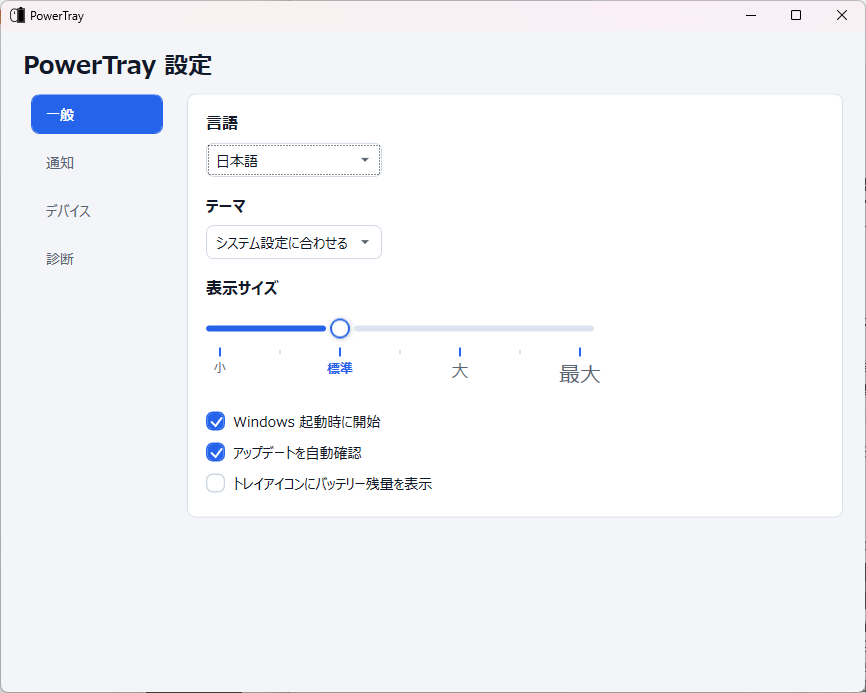
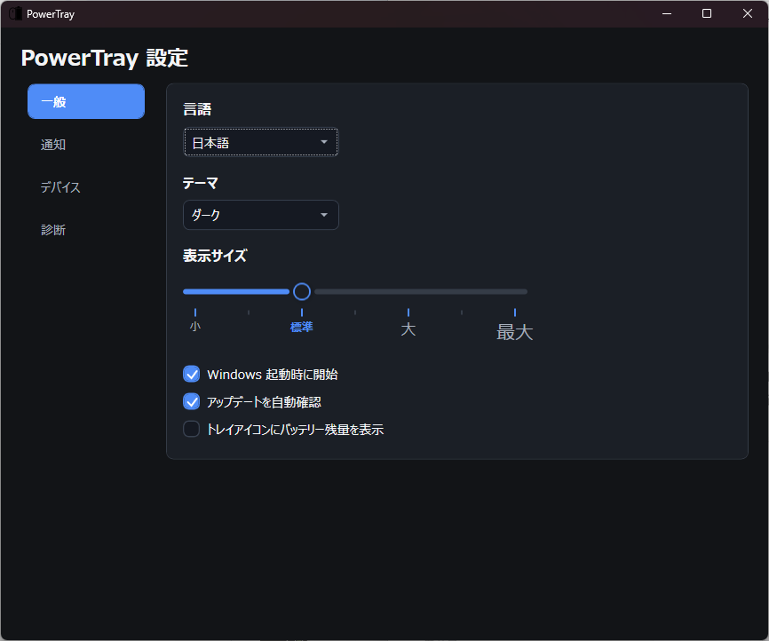
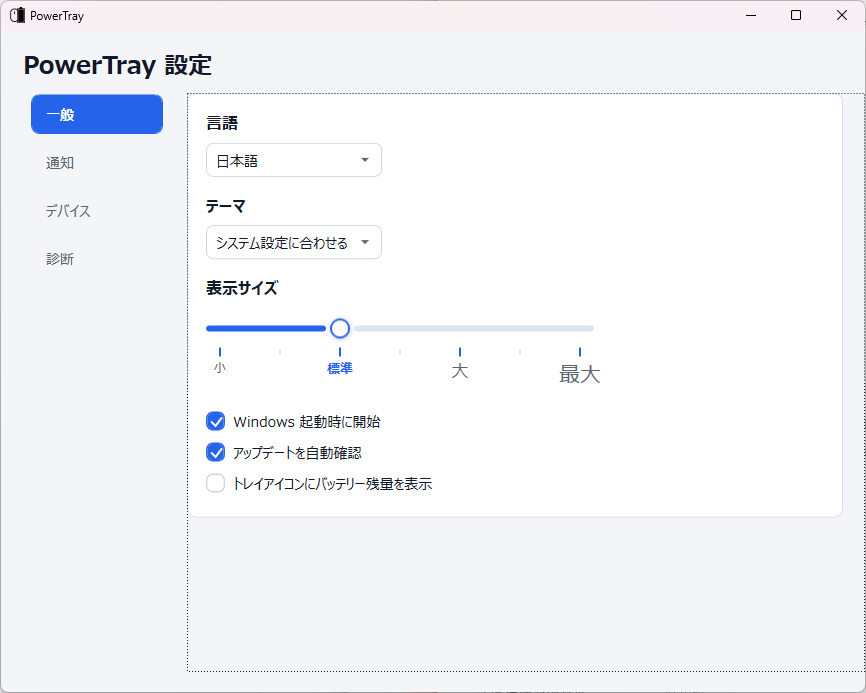
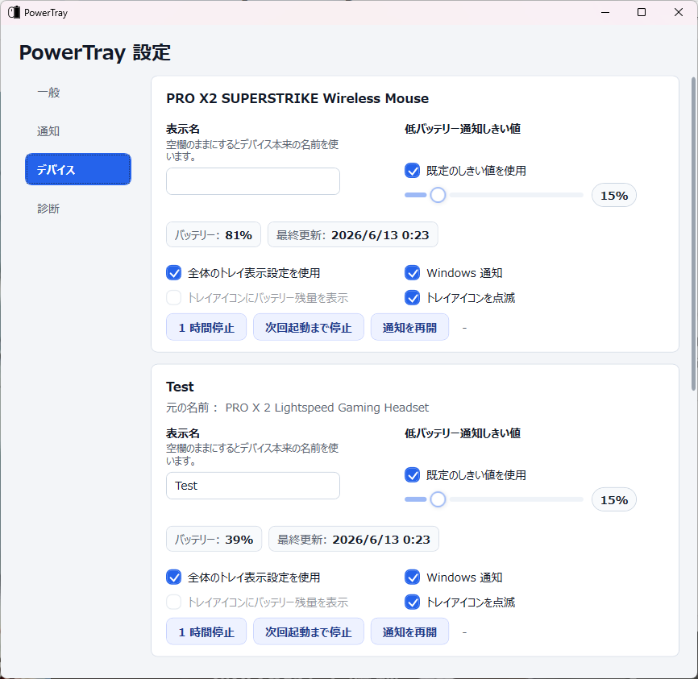

# PowerTray

**言語:** [English](README.md) | [简体中文](README.zh-CN.md) | **日本語**

## English Overview

PowerTray is a native Windows tray utility for Logitech wireless device battery status. It is based on [andyvorld/LGSTrayBattery](https://github.com/andyvorld/LGSTrayBattery), but the current app reads compatible Logitech HID++ devices directly through the Windows HID stack instead of depending on the Logitech G Hub local backend.

## 中文概要

PowerTray 是一个用于 Logitech 无线设备电量显示的 Windows 托盘工具，基于 [andyvorld/LGSTrayBattery](https://github.com/andyvorld/LGSTrayBattery) 改造。当前版本不依赖 Logitech G Hub 本地后端，而是通过 Windows HID 直接读取兼容设备的 HID++ 电量信息。

## 日本語概要

PowerTray は Logitech ワイヤレスデバイスのバッテリー状態を表示する Windows トレイアプリです。[andyvorld/LGSTrayBattery](https://github.com/andyvorld/LGSTrayBattery) をベースにしていますが、現在の PowerTray は Logitech G Hub のローカルバックエンドに依存せず、Windows HID 経由で互換 HID++ デバイスを直接読み取ります。

トレイのバッテリー表示、低バッテリー通知、デバイス別設定、ローカル HTTP 互換 API、診断エクスポート、多言語 UI、Windows インストーラーを提供します。

## 主な機能

- `hidapi` による Logitech HID++ バッテリー情報のネイティブ読み取り。
- `lghub_agent.exe` や `ws://localhost:9010` に依存しません。
- 選択したデバイスを個別のトレイアイコンとして表示できます。アイコン表示と数値バッテリー表示に対応します。
- デバイスごとに表示名、トレイ表示方式、低バッテリーしきい値、Windows 通知、トレイ点滅、通知の一時停止を設定できます。
- グローバルの低バッテリーしきい値、通知設定、通知しない時間帯、全画面アプリ使用中の通知抑制に対応します。
- アプリ UI とインストーラーは English、简体中文、日本語に対応します。
- ライト、ダーク、システム連動テーマに対応します。
- 4 段階の表示サイズと、英語・中国語・日本語に合わせたフォント選択に対応します。
- 設定画面、ダイアログ、診断テキストの右クリックメニュー、トレイ右クリックメニューをモダンな見た目に統一しています。
- `/devices` と `/device/{id}` XML のローカル HTTP 互換 API を提供します。
- 診断エクスポートのプライバシーを強化し、生のシリアル番号や生の HID 識別応答を出力しません。
- 更新フローを強化し、想定されたインストーラー asset のみを選択し、`.sha256` を検証します。
- Windows x64 用の軽量版インストーラーとランタイム同梱版インストーラーを提供し、どちらにも `.sha256` を生成します。

## 使い方

[latest Release page](https://github.com/JumpTwiceShou/PowerTray/releases/latest) からインストーラーをダウンロードします。`PowerTraySetup.exe` は軽量版インストーラーで、サイズが小さく、Windows にインストール済みの .NET Desktop Runtime を使用します。`PowerTraySetup-full.exe` はランタイム同梱版インストーラーで、サイズは大きくなりますが、.NET Desktop Runtime がない環境ではこちらが安全です。

1. インストーラーを実行し、初期言語、インストール先、Windows 起動時の開始、自動更新確認、セットアップ完了後に PowerTray を起動するかを選びます。
2. PowerTray を起動します。Windows の通知領域で動作します。
3. トレイメニューから **PowerTray 設定** を開きます。
4. **一般** で、言語、テーマ、表示サイズ、Windows 起動時の開始、自動更新確認、グローバルの数値バッテリー表示を設定します。
5. **通知** で、既定の低バッテリーしきい値、Windows 通知、トレイアイコン点滅、全画面アプリ使用中の通知抑制、通知しない時間帯を設定します。
6. **デバイス** で、デバイス別のトレイ表示、表示名、低バッテリーしきい値、通知の一時停止や再開を設定します。
7. レシーバーやデバイスを接続し直した後は、トレイメニューの **デバイスを再スキャン** を使います。
8. デバイスが検出されない場合や、メンテナーから依頼された場合は、**診断** から診断情報をエクスポートします。

## スクリーンショットとアイコン例

### 一般設定

言語、テーマ、表示サイズ、Windows 起動時の開始、自動更新確認、グローバルのトレイ数値表示を設定できます。



### ダークテーマの一般設定

ダークテーマでは、同じレイアウトと操作を暗い配色で利用できます。



### 低バッテリー通知設定

既定の低バッテリーしきい値、Windows 通知、トレイアイコン点滅、全画面アプリ中の通知抑制、通知しない時間帯を設定できます。



### デバイス設定

各デバイスはグローバルのトレイ表示設定に従うことも、デバイス別に数値表示、しきい値、通知、点滅、表示名、通知の一時停止を設定することもできます。



### トレイ表示

トレイの tooltip には現在のデバイス名とバッテリー残量が表示されます。表示名を設定した場合、UI と通知ではその名前が使われます。

| デバイス名 | 表示名 |
| --- | --- |
|  |  |

### 複数デバイスのアイコン


選択したデバイスは個別のトレイアイコンとして表示できます。少なくとも 1 つのデバイスアイコンを表示している場合、PowerTray は汎用のメイントレイアイコンを隠します。

### 数値バッテリーアイコン


数値モードでは、現在のバッテリー残量をトレイアイコン内に直接表示します。右クリックしたアイコンに応じて、トレイメニューはグローバル設定またはデバイス別の上書き設定を切り替えます。

### 反応型アイコン


アイコンはデバイス種別に応じて変わります。現在の UI assets はマウス、キーボード、ヘッドセット風のアイコンに対応しています。


トレイアイコンは Windows のライト/ダークテーマに追従します。


デバイスが HID++ 経由で充電状態を報告する場合、充電中の表示になります。

### HTTP サーバーデモ


ローカル HTTP サーバーは、シンプルなデバイス一覧と XML バッテリー endpoint を提供します。


一部のアイコンと API デモ画像は、上流の `LGSTrayBattery` README から再利用しています。

## 現在のデバイス対応状況

ネイティブバックエンドで検証済みのデバイス:

| デバイス | 状態 | 補足 |
| --- | --- | --- |
| `PRO X2 SUPERSTRIKE Wireless Mouse` | 検証済み | LIGHTSPEED レシーバー経由でネイティブ HID++ バッテリー情報を読み取ります。 |
| `PRO X 2 Lightspeed Gaming Headset` | 検証済み | ネイティブのヘッドセットバッテリー読み取りを確認済みです。 |
| G533 / G535 / G733 / G935 / PRO X Wireless ヘッドセット | 製品 ID で認識 | 互換 HID++ バッテリー機能が公開されている場合のみ利用できます。 |
| G522 LIGHTSPEED | 実装済み、実機未検証 | Centurion `0x50` transport と `0x0104` バッテリー読み取りを実装済みです。 |

その他の Logitech HID++ デバイスも、Windows が互換 HID++ endpoint を公開し、デバイスが対応バッテリー機能を報告する場合は動作する可能性があります: `0x1000`、`0x1001`、`0x1004`、`0x1F20`。

## 位置づけと制限

PowerTray は軽量なバッテリー/状態表示トレイユーティリティです。ボタン割り当て、プロファイル、マクロ、ライティング、ファームウェア更新、Dolby/Atmos 設定、マイク設定などを扱う Logitech G Hub の代替ではありません。

PowerTray は Logitech G Hub バックエンドを必要とせず、Logitech のドライバー、ファームウェア、プロファイル、デバイス設定を変更しません。デバイス対応は、Windows が公開する HID++ endpoint と、デバイスが報告するバッテリー機能に依存します。

## セキュリティとプライバシー

- PowerTray はローカルの HID++ バッテリー情報を読み取り、ユーザー設定を `%APPDATA%\PowerTray` に保存します。
- PowerTray はテレメトリを収集しません。
- 自動更新確認を有効にした場合、このリポジトリの GitHub Releases API にアクセスします。
- ローカル HTTP 互換 API は既定で `localhost` を使い、設定で明示的にリモートバインドを有効にしない限り loopback に戻します。
- 診断エクスポートでは、生のシリアル番号、生の HID 識別応答、生のデバイス識別 payload を出力しません。
- アップデーターは想定された PowerTray インストーラー asset 名だけを受け入れ、ダウンロードしたインストーラーの実行を案内する前に対応する `.sha256` を検証します。
- 現在のインストーラーはコード署名されていません。`.sha256` は完全性確認用であり、Authenticode 署名や発行元の評価を置き換えるものではありません。

## インストール

[latest release](https://github.com/JumpTwiceShou/PowerTray/releases/latest) から `PowerTraySetup.exe` をダウンロードして実行します。

.NET Desktop Runtime を同梱したインストーラーが必要な場合のみ、`PowerTraySetup-full.exe` を使ってください。

インストール時に選べる項目:

- 初期言語: English、简体中文、日本語。
- インストール先。
- Windows 起動時に PowerTray を開始するか。
- 更新を自動確認するか。
- インストール完了後に PowerTray を起動するか。

ユーザー設定の保存先:

```text
%APPDATA%\PowerTray\settings.json
```

## トラブルシューティング

- 対応デバイスが表示されない場合は、レシーバーまたはデバイスを接続し直し、トレイメニューから **デバイスを再スキャン** を実行してください。
- G733 などのヘッドセットでバッテリー情報が表示されない場合、その Windows HID endpoint で互換 HID++ バッテリー機能が公開されていない可能性があります。
- 軽量版インストーラーが .NET 8 Desktop Runtime の不足を表示した場合は、先にランタイムをインストールするか、`PowerTraySetup-full.exe` を使ってください。
- Windows Defender がインストーラーを検出した場合、既定では警告をそのまま回避しないでください。検出名、ファイル名、Defender Security Intelligence のバージョンを添えて issue を作成してください。
- HTTP API にアクセスできない場合は、別のローカルプロセスが `12321` ポートを使用していないか確認してください。
- G Hub は不要です。G Hub がインストールされていても、PowerTray は既定でネイティブバックエンドからバッテリー情報を読み取り、Logitech のドライバーやプロファイル設定を変更しません。

## HTTP API

ローカル HTTP サーバーの既定アドレス:

```text
http://localhost:12321/
```

Endpoints:

- `GET /devices`: 利用可能なデバイスとリンクを返します。
- `GET /device/{deviceId}`: XML バッテリー情報を返します。

XML 例:

```xml
<?xml version="1.0" encoding="UTF-8"?>
<xml>
  <device_id>native-device-id</device_id>
  <device_name>Original Logitech Device Name</device_name>
  <device_type>Mouse</device_type>
  <battery_percent>86.00</battery_percent>
  <battery_voltage>0.00</battery_voltage>
  <mileage>-1.00</mileage>
  <charging>False</charging>
  <last_update>06/05/2026 22:28:44 +09:00</last_update>
</xml>
```

ネイティブモードでは G Hub の mileage データを取得しないため、`mileage` は `-1.00` になります。

## ビルド

x64 .NET 8 SDK を使用します:

```powershell
dotnet build PowerTray.sln -c Debug
powershell -ExecutionPolicy Bypass -File .\build-installer.ps1
```

インストーラーの出力先:

```text
bin\Release\installer\PowerTraySetup.exe
bin\Release\installer\PowerTraySetup.exe.sha256
bin\Release\installer\PowerTraySetup-full.exe
bin\Release\installer\PowerTraySetup-full.exe.sha256
```

各 `.sha256` ファイルは `<sha256_hash>  <filename>` 形式で、ローカルの絶対パスではなくファイル名だけを記録します。

生成された `bin`、`obj`、publish 出力、インストーラー payload zip はコミット対象ではありません。Release notes は `release-notes/` に置きます。

## ライセンス

PowerTray は GPL-3.0 ライセンスです。詳細は [LICENSE](LICENSE) を参照してください。

## 謝辞

次のプロジェクトと作者に感謝します。

- [andyvorld/LGSTrayBattery](https://github.com/andyvorld/LGSTrayBattery): PowerTray のベースとなったプロジェクト。
- [andyvorld/LGSTrayBattery_GHUB](https://github.com/andyvorld/LGSTrayBattery_GHUB): 上流プロジェクトで参照されている関連プロジェクト。
- [Solaar](https://github.com/pwr-Solaar/Solaar): 上流プロジェクトが HID++ プロトコル知識と解析資料として謝辞を示しているプロジェクト。
- [XB1ControllerBatteryIndicator](https://github.com/NiyaShy/XB1ControllerBatteryIndicator): 上流プロジェクトがアイコンの着想元として謝辞を示しているプロジェクト。
- [The Noun Project](https://thenounproject.com/) と、上流プロジェクトで謝辞を示している icon authors: projecthayat、HideMaru、Peter Lakenbrink。
- [hidapi](https://github.com/libusb/hidapi): ネイティブバックエンドで使用している HID ライブラリ。
