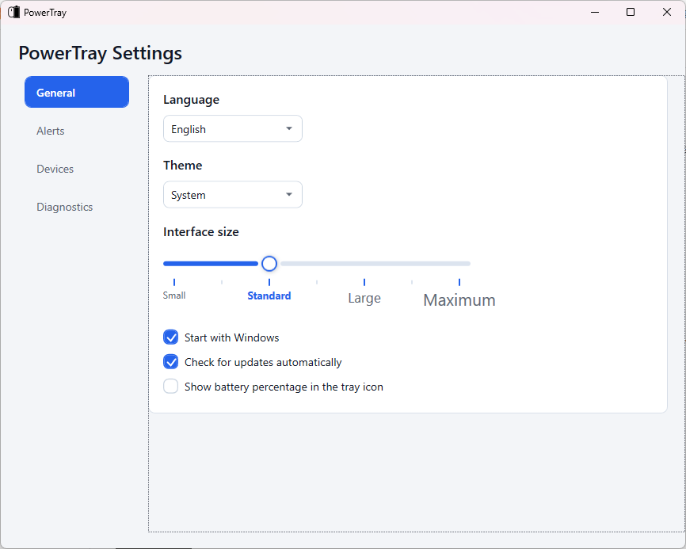
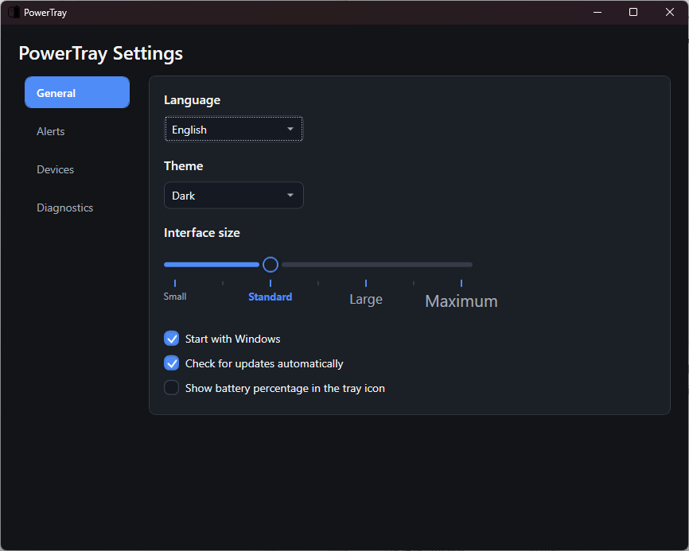
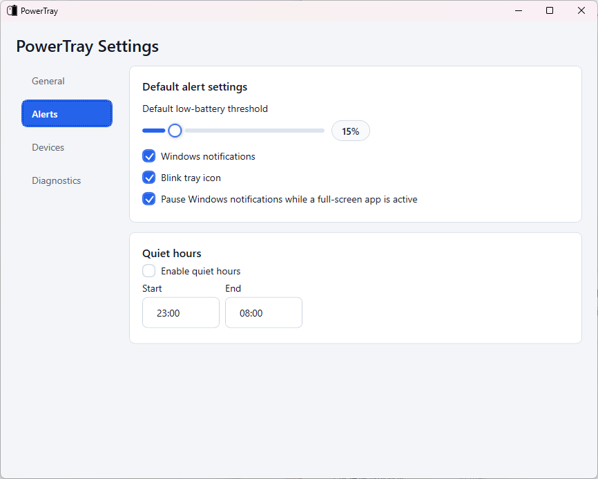
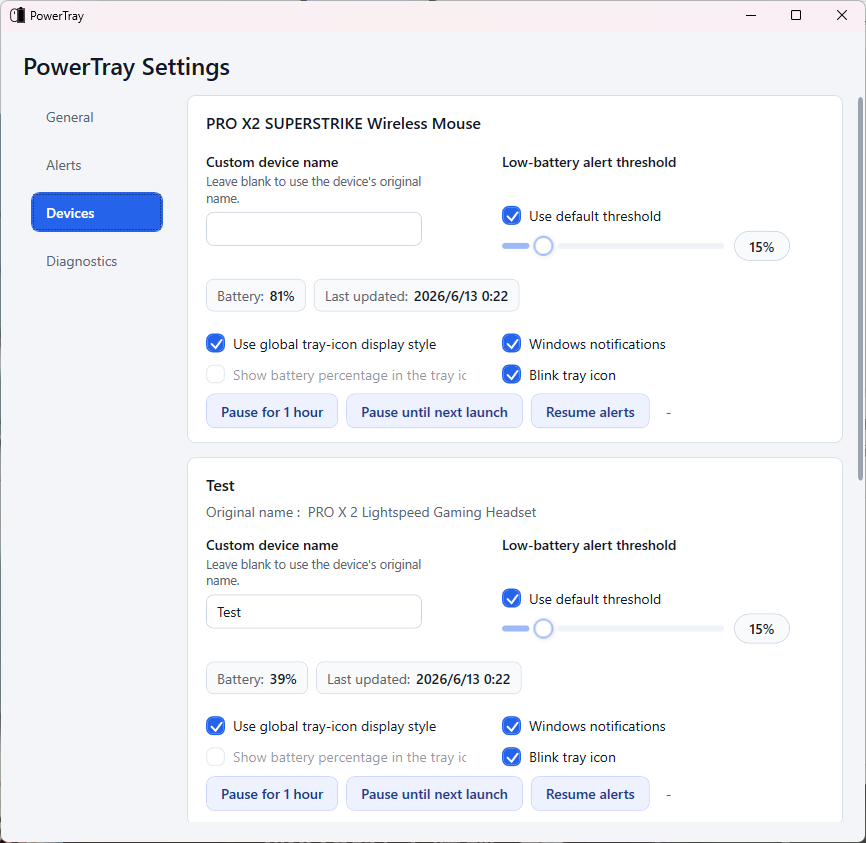
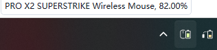
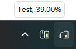

# PowerTray

**Language:** **English** | [Simplified Chinese](README.zh-CN.md) | [Japanese](README.ja-JP.md)

## English Overview

PowerTray is a native Windows tray utility for Logitech wireless device battery status. It is based on [andyvorld/LGSTrayBattery](https://github.com/andyvorld/LGSTrayBattery), but the current app reads compatible Logitech HID++ devices directly through the Windows HID stack instead of depending on the Logitech G Hub local backend.

PowerTray focuses on tray battery indicators, low-battery alerts, per-device settings, a local compatibility HTTP API, diagnostics, multilingual UI, and a lightweight Windows installer.

## 中文概要

PowerTray 是一个用于 Logitech 无线设备电量显示的 Windows 托盘工具，基于 [andyvorld/LGSTrayBattery](https://github.com/andyvorld/LGSTrayBattery) 改造。当前版本不依赖 Logitech G Hub 本地后端，而是通过 Windows HID 直接读取兼容设备的 HID++ 电量信息。

它提供托盘电量图标、低电量提醒、单设备设置、本地 HTTP 兼容接口、诊断导出、多语言界面和 Windows 安装器。

## 日本語概要

PowerTray は Logitech ワイヤレスデバイスのバッテリー状態を表示する Windows トレイアプリです。[andyvorld/LGSTrayBattery](https://github.com/andyvorld/LGSTrayBattery) をベースにしていますが、現在の PowerTray は Logitech G Hub のローカルバックエンドに依存せず、Windows HID 経由で互換 HID++ デバイスを直接読み取ります。

トレイのバッテリー表示、低バッテリー通知、デバイス別設定、ローカル HTTP 互換 API、診断エクスポート、多言語 UI、Windows インストーラーを提供します。

## Highlights

- Native Logitech HID++ battery monitoring through `hidapi`.
- No dependency on `lghub_agent.exe` or `ws://localhost:9010`.
- Separate tray icons for selected devices, including icon mode and numeric battery mode.
- Per-device alias, tray display behavior, low-battery threshold, Windows notifications, tray blinking, and alert pause controls.
- Global low-battery threshold, notification controls, quiet hours, and full-screen notification suppression.
- English, Simplified Chinese, and Japanese app UI and installer language support.
- Light, dark, and system theme modes.
- Four interface-size levels with language-aware font choices for English, Chinese, and Japanese.
- Modern themed settings, dialogs, diagnostics text menu, and tray context menu.
- Local HTTP compatibility API for `/devices` and `/device/{id}` XML.
- Diagnostics privacy hardening: exported reports redact raw serial numbers and raw HID identity responses.
- Safer update flow: strict installer asset selection and `.sha256` checksum verification.
- Windows x64 lightweight and full installers, both with `.sha256` checksum files.

## Usage

Download an installer from the [latest Release page](https://github.com/JumpTwiceShou/PowerTray/releases/latest). Choose `PowerTraySetup.exe` for the lightweight installer, which is smaller and uses the .NET Desktop Runtime already installed on Windows. Choose `PowerTraySetup-full.exe` if you want the installer to include the .NET Desktop Runtime; it is larger, but it is the safer choice when the runtime is missing.

1. Run the installer and choose the initial language, install location, startup option, update-check option, and whether to launch PowerTray after setup.
2. Launch PowerTray. It will run in the Windows notification area.
3. Open **PowerTray Settings** from the tray menu.
4. On **General**, choose language, theme, interface size, startup behavior, update checks, and global numeric tray display.
5. On **Alerts**, set the default low-battery threshold, Windows notifications, tray blinking, full-screen notification suppression, and quiet hours.
6. On **Devices**, select per-device tray behavior, rename devices for the UI, set per-device low-battery thresholds, and pause or resume alerts.
7. Use **Rescan devices** from the tray menu after reconnecting a receiver or device.
8. Use **Diagnostics** when a device is not detected or when a maintainer asks for a diagnostic export.

## Screenshots and Icon Demos

### General Settings

Set the app language, theme, interface size, startup behavior, update checks, and the global numeric tray icon option.



### General Settings in Dark Theme

Dark mode uses the same layout and controls with a darker surface palette.



### Alert Settings

Configure the default low-battery threshold, Windows notifications, tray-icon blinking, full-screen suppression, and quiet hours.



### Device Settings

Each device can keep the global tray-display style or use its own battery display, threshold, notification, blink, alias, and pause settings.



### Tray Indicator

Tray tooltips show the current device name and battery percentage. Aliases are used in the UI and notification surfaces.

| Device name | Alias |
| --- | --- |
|  |  |

### Multiple Device Icons


Selected devices can be shown as separate tray icons. When at least one device icon is selected, PowerTray hides the generic main tray icon.

### Numeric Battery Icon


Numeric mode displays the current battery percentage directly in the tray icon. The tray menu can control the global numeric display option or a device-specific override depending on which icon was right-clicked.

### Reactive Icons


Icons change by device type. Current UI assets include mouse, keyboard, and headset-style indicators.


Tray icons react to the Windows light/dark theme.


Charging status is reflected when the device reports it through HID++.

### HTTP Server Demo


The local HTTP server exposes a simple device list and XML battery endpoint.


Some icon and API demo images are reused from the upstream `LGSTrayBattery` README with thanks.

## Current Device Coverage

The native backend has been validated on:

| Device | Status | Notes |
| --- | --- | --- |
| `PRO X2 SUPERSTRIKE Wireless Mouse` | Validated | Native HID++ battery reads through a LIGHTSPEED receiver. |
| `PRO X 2 Lightspeed Gaming Headset` | Validated | Native headset battery reads. |
| G533 / G535 / G733 / G935 / PRO X Wireless headsets | Recognized by product id | Expected to work only when a compatible HID++ battery feature is exposed. |
| G522 LIGHTSPEED | Implemented, not physically validated | Centurion `0x50` transport and `0x0104` battery reads are implemented. |

Other Logitech HID++ devices may work if Windows exposes a compatible HID++ endpoint and the device reports a supported battery feature: `0x1000`, `0x1001`, `0x1004`, or `0x1F20`.

## Scope and Limitations

PowerTray is a lightweight battery/status tray utility. It does not replace Logitech G Hub for button mapping, profiles, macros, lighting, firmware updates, Dolby/Atmos settings, microphone controls, or other device configuration features.

PowerTray does not require the Logitech G Hub backend and does not modify Logitech drivers, firmware, profiles, or device configuration. Device support depends on the HID++ endpoints and battery features exposed by Windows for each device.

## Security and Privacy

- PowerTray reads local HID++ battery data and stores user settings under `%APPDATA%\PowerTray`.
- PowerTray does not collect telemetry.
- If automatic update checks are enabled, the app contacts the GitHub Releases API for this repository.
- The local HTTP compatibility API defaults to `localhost` and falls back to loopback unless remote binding is explicitly enabled in configuration.
- Diagnostics exports redact raw serial numbers, raw HID identity responses, and raw device identity payloads.
- The updater only accepts expected PowerTray installer asset names and verifies matching `.sha256` checksum records before offering to run a downloaded installer.
- Current installers are not code-signed. `.sha256` files verify integrity only; they do not replace Authenticode signing or publisher reputation.

## Install

Download `PowerTraySetup.exe` from the [latest release](https://github.com/JumpTwiceShou/PowerTray/releases/latest) and run it.

Use `PowerTraySetup-full.exe` only if you need the installer to include the .NET Desktop Runtime.

During installation you can choose:

- Initial language: English, Simplified Chinese, or Japanese.
- Install location.
- Whether PowerTray starts with Windows.
- Whether PowerTray checks for updates automatically.
- Whether PowerTray launches after installation.

User settings are stored at:

```text
%APPDATA%\PowerTray\settings.json
```

## Troubleshooting

- If no supported devices appear, reconnect the receiver or device, then choose **Rescan devices** from the tray menu.
- If a headset such as G733 does not show battery data, the device may not expose a compatible HID++ battery feature on the current Windows HID endpoint.
- If the lightweight installer reports that .NET 8 Desktop Runtime is missing, install the runtime first or use `PowerTraySetup-full.exe`.
- If Windows Defender flags an installer, do not bypass the warning by default. Open an issue with the detection name, file name, and Defender Security Intelligence version so the release can be reviewed.
- If the HTTP API is not reachable, check whether another local process is already using port `12321`.
- G Hub is not required. If G Hub is installed, PowerTray still reads battery data through its native backend by default and does not change Logitech driver or profile settings.

## HTTP API

The local HTTP server defaults to:

```text
http://localhost:12321/
```

Endpoints:

- `GET /devices`: lists available devices and links.
- `GET /device/{deviceId}`: returns XML battery data.

Example XML:

```xml
<?xml version="1.0" encoding="UTF-8"?>
<xml>
  <device_id>native-device-id</device_id>
  <device_name>Original Logitech Device Name</device_name>
  <device_type>Mouse</device_type>
  <battery_percent>86.00</battery_percent>
  <battery_voltage>0.00</battery_voltage>
  <mileage>-1.00</mileage>
  <charging>False</charging>
  <last_update>06/05/2026 22:28:44 +09:00</last_update>
</xml>
```

Native mode does not expose G Hub mileage data, so `mileage` is reported as `-1.00`.

## Build

Use the x64 .NET 8 SDK:

```powershell
dotnet build PowerTray.sln -c Debug
powershell -ExecutionPolicy Bypass -File .\build-installer.ps1
```

The installer is generated at:

```text
bin\Release\installer\PowerTraySetup.exe
bin\Release\installer\PowerTraySetup.exe.sha256
bin\Release\installer\PowerTraySetup-full.exe
bin\Release\installer\PowerTraySetup-full.exe.sha256
```

Each `.sha256` file uses the format `<sha256_hash>  <filename>` and records only the file name, not a local absolute path.

Generated `bin`, `obj`, publish output, and installer payload zip files are not intended to be committed. Release notes are stored under `release-notes/`.

## License

PowerTray is licensed under GPL-3.0. See [LICENSE](LICENSE).

## Acknowledgements

Thanks to:

- [andyvorld/LGSTrayBattery](https://github.com/andyvorld/LGSTrayBattery), the project this work is based on.
- [andyvorld/LGSTrayBattery_GHUB](https://github.com/andyvorld/LGSTrayBattery_GHUB), referenced by the upstream project.
- [Solaar](https://github.com/pwr-Solaar/Solaar), for HID++ protocol knowledge and reverse-engineering references acknowledged by the upstream project.
- [XB1ControllerBatteryIndicator](https://github.com/NiyaShy/XB1ControllerBatteryIndicator), for the icon idea and base acknowledged by the upstream project.
- [The Noun Project](https://thenounproject.com/), and the icon authors acknowledged by the upstream project: projecthayat, HideMaru, and Peter Lakenbrink.
- [hidapi](https://github.com/libusb/hidapi), for the HID library used by the native backend.
