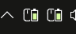
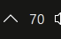
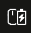
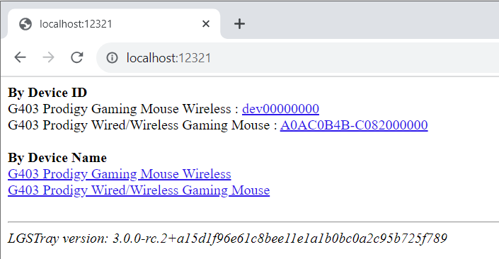

# PowerTray

**语言:** [English](README.md) | **简体中文**

---

<p align="center">
  🌐 <strong>Language / 语言</strong><br>
  <a href="README.md">English</a> | <strong>简体中文</strong>
</p>

---

PowerTray 是基于 [andyvorld/LGSTrayBattery](https://github.com/andyvorld/LGSTrayBattery) 进行 vibe 修改和优化的项目。它保留了原项目的托盘电量监控思路、HTTP 兼容接口和 HID++ 方向，但改造成不依赖 Logitech G Hub 后端的 native-only 罗技设备电量托盘工具。

## 功能亮点

- 通过 `hidapi` 直接读取 Logitech HID++ 电量。
- 不依赖 `lghub_agent.exe` 或 `ws://localhost:9010`。
- 可为已选择设备显示独立托盘图标，支持鼠标/耳机图标和数字电量图标。
- 每个设备可单独设置低电量阈值、Windows 通知、托盘闪烁、别名和暂停提醒。
- 支持静音时段，以及当前台存在全屏软件时暂停 Windows 通知。
- 应用和安装器支持英文/简体中文，默认英文。
- 提供单 EXE Windows x64 安装器，可选择是否开机自启。
- 保留兼容 HTTP API：`/devices` 和 `/device/{id}` XML。

## 截图和图标演示

以下部分图标和 API 演示图片复用了上游 `LGSTrayBattery` README 的素材，在此致谢。

### 托盘电量指示


托盘 tooltip 会显示电量百分比；如果设备支持，也会显示电压信息。

### 多设备图标



被选择的设备可以显示为独立托盘图标。当至少选择一个设备图标时，PowerTray 会隐藏通用主托盘图标。

### 数字电量图标



数字模式会直接在托盘图标中显示当前电量百分比。

### 响应式图标


图标会根据设备类型变化。目前 UI 资源支持鼠标、键盘和耳机风格图标。


图标会响应 Windows 浅色/深色主题。



当设备通过 HID++ 上报充电状态时，托盘图标会反映充电状态。

### HTTP 服务演示



本地 HTTP 服务提供简单的设备列表和 XML 电量接口。


## 当前设备覆盖

native 后端已验证：

- `PRO X2 SUPERSTRIKE Wireless Mouse`
- `PRO X 2 Lightspeed Gaming Headset`

其他 Logitech HID++ 设备如果通过兼容 HID++ endpoint 暴露受支持的电量 feature（`0x1000`、`0x1001`、`0x1004`），也可能可用。

## 安装

从 [latest release](https://github.com/JumpTwiceShou/PowerTray/releases/latest) 下载 `PowerTraySetup.exe` 并运行。只有在需要安装包自带 .NET 运行时时，才使用 `PowerTraySetup-full.exe`。

安装时可以选择：

- 初始语言：English 或简体中文。
- 安装位置。
- 是否开机自启。
- 安装完成后是否立即启动 PowerTray。

用户设置保存于：

```text
%APPDATA%\PowerTray\settings.json
```

## 设置

设置窗口包含：

- 常规：语言、开机自启、数字电量图标。
- 提醒：全局低电量默认值、静音时段、全屏软件前台时暂停 Windows 通知。
- 设备：每设备别名、低电量阈值、通知、托盘闪烁、暂停提醒、测试通知、测试闪烁。
- 诊断：G Hub 进程状态、`localhost:9010` 可达性、设备更新时间、提醒配置摘要和诊断导出。

设备别名只影响界面和通知。HTTP XML API 仍输出罗技原始设备名。

## HTTP API

本地 HTTP 服务默认地址：

```text
http://localhost:12321/
```

接口：

- `GET /devices`：列出可用设备和链接。
- `GET /device/{deviceId}`：返回 XML 电量数据。

XML 示例：

```xml
<?xml version="1.0" encoding="UTF-8"?>
<xml>
  <device_id>native-device-id</device_id>
  <device_name>Original Logitech Device Name</device_name>
  <device_type>Mouse</device_type>
  <battery_percent>86.00</battery_percent>
  <battery_voltage>0.00</battery_voltage>
  <mileage>-1.00</mileage>
  <charging>False</charging>
  <last_update>06/05/2026 22:28:44 +09:00</last_update>
</xml>
```

Native 模式没有 G Hub 的 mileage 数据，因此 `mileage` 返回 `-1.00`。

## 构建

使用本机 bundled SDK：

```powershell
F:\logi\.dotnet-sdk\dotnet.exe build PowerTray.sln -c Debug
powershell -ExecutionPolicy Bypass -File .\build-installer.ps1
```

安装器输出：

```text
bin\Release\installer\PowerTraySetup.exe
```

生成的 `bin`、`obj`、publish 输出和安装器 payload zip 不应提交到仓库。

## 许可证

PowerTray 使用 GPL-3.0 许可证。见 [LICENSE](LICENSE)。

## 致谢

感谢：

- [andyvorld/LGSTrayBattery](https://github.com/andyvorld/LGSTrayBattery)，本项目参考和修改优化的基础项目。
- [andyvorld/LGSTrayBattery_GHUB](https://github.com/andyvorld/LGSTrayBattery_GHUB)，上游项目引用的相关项目。
- [Solaar](https://github.com/pwr-Solaar/Solaar)，上游项目致谢其 HID++ 协议资料和逆向参考。
- [XB1ControllerBatteryIndicator](https://github.com/NiyaShy/XB1ControllerBatteryIndicator)，上游项目致谢其图标思路和基础。
- [The Noun Project](https://thenounproject.com/) 以及上游项目致谢的图标作者 projecthayat、HideMaru、Peter Lakenbrink。
- [hidapi](https://github.com/libusb/hidapi)，native 后端使用的 HID 库。
