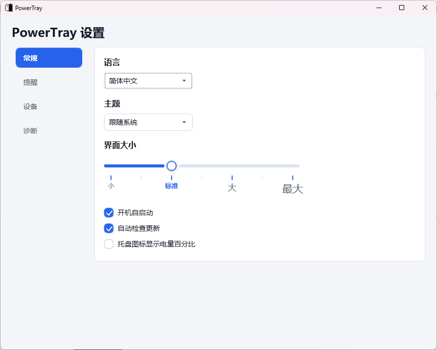
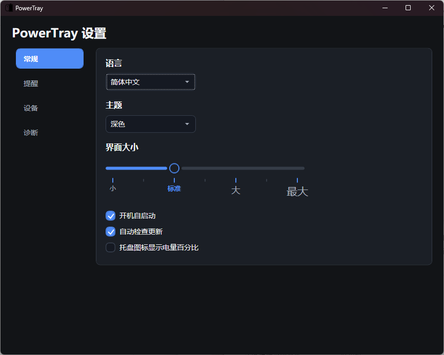
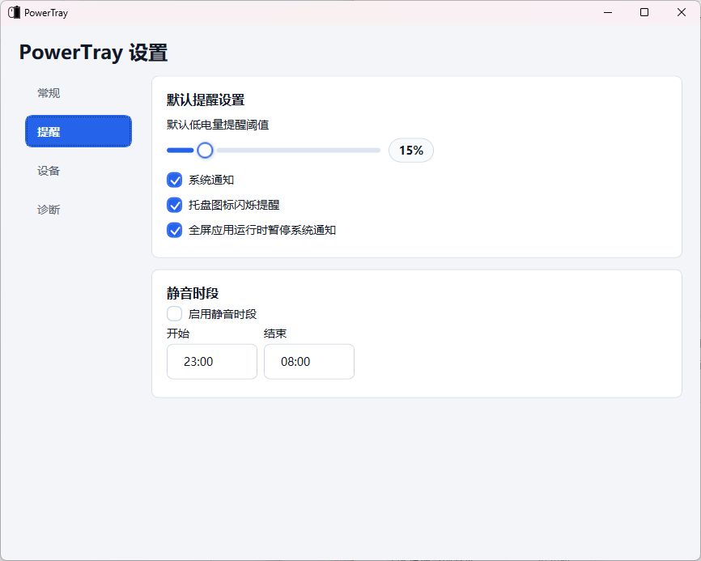
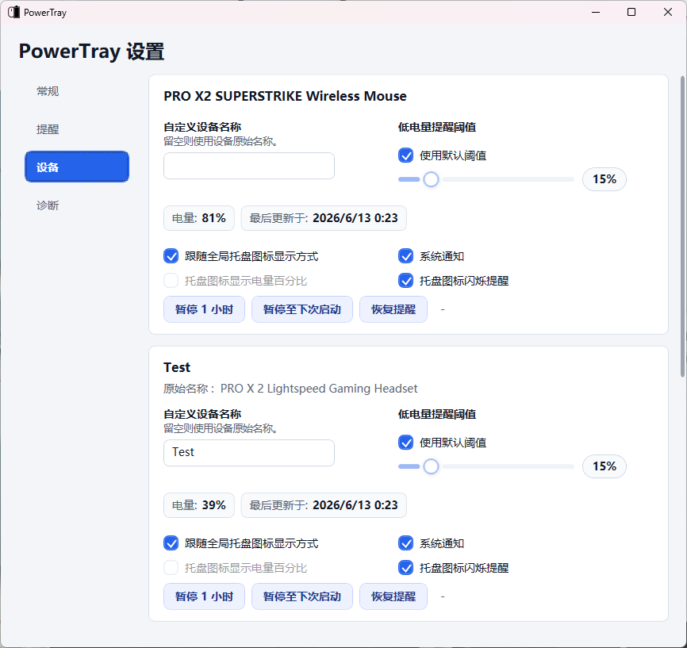

# PowerTray

**语言：** [English](README.md) | **简体中文** | [日本語](README.ja-JP.md)

## English Overview

PowerTray is a native Windows tray utility for Logitech wireless device battery status. It is based on [andyvorld/LGSTrayBattery](https://github.com/andyvorld/LGSTrayBattery), but the current app reads compatible Logitech HID++ devices directly through the Windows HID stack instead of depending on the Logitech G Hub local backend.

## 中文概要

PowerTray 是一个用于 Logitech 无线设备电量显示的 Windows 托盘工具，基于 [andyvorld/LGSTrayBattery](https://github.com/andyvorld/LGSTrayBattery) 改造。当前版本不依赖 Logitech G Hub 本地后端，而是通过 Windows HID 直接读取兼容设备的 HID++ 电量信息。

它专注于托盘电量图标、低电量提醒、单设备设置、本地 HTTP 兼容接口、诊断导出、多语言界面和 Windows 安装器。

## 日本語概要

PowerTray は Logitech ワイヤレスデバイスのバッテリー状態を表示する Windows トレイアプリです。[andyvorld/LGSTrayBattery](https://github.com/andyvorld/LGSTrayBattery) をベースにしていますが、現在の PowerTray は Logitech G Hub のローカルバックエンドに依存せず、Windows HID 経由で互換 HID++ デバイスを直接読み取ります。

## 功能亮点

- 通过 `hidapi` 原生读取 Logitech HID++ 电量信息。
- 不依赖 `lghub_agent.exe` 或 `ws://localhost:9010`。
- 可为选中的设备显示独立托盘图标，支持图标模式和数字电量模式。
- 每个设备可单独设置别名、托盘显示方式、低电量阈值、系统通知、托盘闪烁和提醒暂停。
- 支持全局低电量阈值、通知控制、静音时段，以及全屏应用运行时暂停通知。
- 应用界面和安装器支持 English、简体中文、日本語。
- 支持浅色、深色和跟随系统主题。
- 支持四档界面大小，并为英文、中文和日文选择更适合的字体。
- 设置窗口、对话框、诊断右键菜单和托盘右键菜单使用统一的现代化样式。
- 保留本地 HTTP 兼容 API：`/devices` 和 `/device/{id}` XML。
- 诊断隐私加固：导出报告会脱敏原始序列号和原始 HID 身份响应。
- 更新安全加固：严格选择安装器资源，并校验 `.sha256`。
- 提供 Windows x64 轻量版和完整运行时版安装器，均生成 `.sha256` 校验文件。

## 使用方法

从 [latest Release 页面](https://github.com/JumpTwiceShou/PowerTray/releases/latest) 下载安装器。`PowerTraySetup.exe` 是轻量版安装器，体积更小，使用系统中已有的 .NET Desktop Runtime；`PowerTraySetup-full.exe` 是完整运行时版安装器，体积更大，但自带 .NET Desktop Runtime，适合系统缺少运行时时使用。

1. 运行安装器，选择初始语言、安装位置、开机启动、自动更新检查，以及安装完成后是否启动 PowerTray。
2. 启动 PowerTray，它会运行在 Windows 通知区域。
3. 从托盘菜单打开 **PowerTray 设置**。
4. 在 **常规** 页面选择语言、主题、界面大小、开机启动、自动更新检查和全局数字电量显示。
5. 在 **提醒** 页面设置默认低电量阈值、系统通知、托盘闪烁、全屏应用通知抑制和静音时段。
6. 在 **设备** 页面设置单设备托盘显示方式、设备别名、单设备低电量阈值，并暂停或恢复提醒。
7. 重新插拔接收器或设备后，可在托盘菜单中使用 **重新扫描设备**。
8. 设备未识别或维护者要求排查时，使用 **诊断** 页面导出诊断信息。

## 截图和图标演示

### 常规设置

可调整应用语言、主题、界面大小、开机启动、自动更新检查和全局托盘数字电量选项。



### 深色主题常规设置

深色主题保留相同布局和控制项，并使用更适合夜间显示的深色配色。



### 低电量提醒设置

可设置默认低电量阈值、系统通知、托盘图标闪烁、全屏应用通知抑制和静音时段。



### 设备设置

每个设备可以跟随全局托盘显示方式，也可以设置自己的数字电量显示、阈值、通知、闪烁、别名和暂停提醒。



### 托盘电量提示

托盘 tooltip 会显示当前设备名称和电量百分比。设置别名后，界面和通知会使用别名。

| 设备名称 | 别名 |
| --- | --- |
|  |  |

### 多设备图标


选中的设备可以显示为独立托盘图标。当至少有一个设备图标被选中时，PowerTray 会隐藏通用主托盘图标。

### 数字电量图标


数字模式会直接在托盘图标中显示当前电量百分比。右键菜单会根据当前右键的图标，在全局数字电量设置和单设备覆盖设置之间自动选择。

### 响应式图标


图标会根据设备类型变化。当前 UI 资源包含鼠标、键盘和耳机风格的图标。


托盘图标会响应 Windows 浅色/深色主题。


当设备通过 HID++ 上报充电状态时，托盘图标会反映充电状态。

### HTTP 服务演示


本地 HTTP 服务提供简单的设备列表和 XML 电量接口。


部分图标和 API 演示图片沿用了上游 `LGSTrayBattery` README 的素材，在此致谢。

## 当前设备覆盖

原生后端已验证：

| 设备 | 状态 | 说明 |
| --- | --- | --- |
| `PRO X2 SUPERSTRIKE Wireless Mouse` | 已验证 | 通过 LIGHTSPEED 接收器读取原生 HID++ 电量。 |
| `PRO X 2 Lightspeed Gaming Headset` | 已验证 | 原生耳机电量读取已验证。 |
| G533 / G535 / G733 / G935 / PRO X Wireless 耳机 | 已按产品 ID 识别 | 只有设备暴露兼容 HID++ 电量功能时才可用。 |
| G522 LIGHTSPEED | 已实现，未实机验证 | 已实现 Centurion `0x50` 传输和 `0x0104` 电量读取。 |

其他 Logitech HID++ 设备如果在 Windows 中暴露兼容 HID++ 端点，并上报受支持的电量功能，也可能可用：`0x1000`、`0x1001`、`0x1004`、`0x1F20`。

## 定位和限制

PowerTray 是轻量的电量/状态托盘工具，不是 Logitech G Hub 的完整替代品。它不负责按键映射、配置文件、宏、灯光、固件更新、Dolby/Atmos 设置、麦克风控制或其他设备配置功能。

PowerTray 不需要 Logitech G Hub 后端，也不会修改 Logitech 驱动、固件、配置文件或设备设置。设备是否可用取决于 Windows 是否暴露兼容的 Logitech HID++ 端点，以及设备是否上报受支持的电量功能。

## 安全和隐私

- PowerTray 只读取本机 HID++ 电量数据，用户设置保存在 `%APPDATA%\PowerTray`。
- PowerTray 不收集遥测数据。
- 如果启用自动更新检查，应用会访问本仓库的 GitHub Releases API。
- 本地 HTTP 兼容 API 默认使用 `localhost`，除非在配置中显式启用远程绑定，否则会回退到 loopback。
- 诊断导出会脱敏原始序列号、原始 HID 身份响应和原始设备身份 payload。
- 更新器只接受预期的 PowerTray 安装器文件名，并在提示运行下载的安装器前校验匹配的 `.sha256`。
- 当前安装器未代码签名。`.sha256` 只用于完整性校验，不能替代 Authenticode 签名或发布者信誉。

## 安装

从 [latest release](https://github.com/JumpTwiceShou/PowerTray/releases/latest) 下载并运行 `PowerTraySetup.exe`。

只有需要安装包自带 .NET Desktop Runtime 时，才需要使用 `PowerTraySetup-full.exe`。

安装时可以选择：

- 初始语言：English、简体中文或日本語。
- 安装位置。
- 是否开机启动 PowerTray。
- 是否自动检查更新。
- 安装完成后是否启动 PowerTray。

用户设置保存在：

```text
%APPDATA%\PowerTray\settings.json
```

## 排障

- 如果没有发现受支持设备，请重新插拔接收器或设备，然后在托盘菜单中选择 **重新扫描设备**。
- 如果 G733 等耳机没有显示电量，可能是该设备在当前 Windows HID 端点上没有暴露兼容的 HID++ 电量功能。
- 如果轻量安装器提示缺少 .NET 8 Desktop Runtime，请先安装运行时，或改用 `PowerTraySetup-full.exe`。
- 如果 Windows Defender 报告安装器风险，不建议默认直接绕过。请提交 issue，并附上检测名、文件名和 Defender Security Intelligence 版本，方便复核 release。
- 如果 HTTP API 无法访问，请检查是否已有其他本地进程占用了 `12321` 端口。
- PowerTray 不需要 G Hub。即使已安装 G Hub，默认也会通过原生后端读取电量，并且不会修改 Logitech 驱动或配置文件。

## HTTP API

本地 HTTP 服务默认地址：

```text
http://localhost:12321/
```

接口：

- `GET /devices`：列出可用设备和链接。
- `GET /device/{deviceId}`：返回 XML 电量数据。

XML 示例：

```xml
<?xml version="1.0" encoding="UTF-8"?>
<xml>
  <device_id>native-device-id</device_id>
  <device_name>Original Logitech Device Name</device_name>
  <device_type>Mouse</device_type>
  <battery_percent>86.00</battery_percent>
  <battery_voltage>0.00</battery_voltage>
  <mileage>-1.00</mileage>
  <charging>False</charging>
  <last_update>06/05/2026 22:28:44 +09:00</last_update>
</xml>
```

原生模式没有 G Hub 的 mileage 数据，因此 `mileage` 返回 `-1.00`。

## 构建

使用 x64 .NET 8 SDK：

```powershell
dotnet build PowerTray.sln -c Debug
powershell -ExecutionPolicy Bypass -File .\build-installer.ps1
```

安装器输出：

```text
bin\Release\installer\PowerTraySetup.exe
bin\Release\installer\PowerTraySetup.exe.sha256
bin\Release\installer\PowerTraySetup-full.exe
bin\Release\installer\PowerTraySetup-full.exe.sha256
```

每个 `.sha256` 文件使用 `<sha256_hash>  <filename>` 格式，只记录文件名，不记录本地绝对路径。

生成的 `bin`、`obj`、publish 输出和安装器 payload zip 不应提交到仓库。Release notes 存放在 `release-notes/`。

## 许可证

PowerTray 使用 GPL-3.0 许可证。见 [LICENSE](LICENSE)。

## 致谢

感谢：

- [andyvorld/LGSTrayBattery](https://github.com/andyvorld/LGSTrayBattery)，本项目参考和改造的基础项目。
- [andyvorld/LGSTrayBattery_GHUB](https://github.com/andyvorld/LGSTrayBattery_GHUB)，上游项目引用的相关项目。
- [Solaar](https://github.com/pwr-Solaar/Solaar)，上游项目致谢其 HID++ 协议资料和逆向参考。
- [XB1ControllerBatteryIndicator](https://github.com/NiyaShy/XB1ControllerBatteryIndicator)，上游项目致谢其图标思路和基础。
- [The Noun Project](https://thenounproject.com/) 以及上游项目致谢的图标作者 projecthayat、HideMaru、Peter Lakenbrink。
- [hidapi](https://github.com/libusb/hidapi)，native 后端使用的 HID 库。
